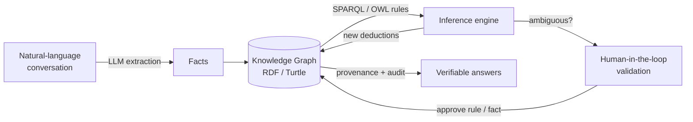

# 🧠 SmartMemory

**Give your LLM structured, verifiable memory** — turn conversations into knowledge graphs your AI can reason over.

<p align="center">
  <em>An MCP server that teaches AI assistants business rules through natural dialogue.</em>
</p>

<p align="center">
  
  
  
  
  
  
</p>

> [!CAUTION]
> **Proof of Concept.** SmartMemory is an experimental implementation of a neuro-symbolic architecture, built to explore how LLMs can interact with knowledge graphs to learn and apply rules. It is **not intended for production use** — treat it as a research and learning playground.

<!-- TODO: add a short GIF of the dashboard + knowledge graph here. A screenshot is worth a thousand commits on a PoC. -->

---

## Why SmartMemory?

LLMs are brilliant talkers with no real memory. Across a conversation they **forget**, they **can't explain *why*** they concluded something, and they happily state things that were never verified.

SmartMemory adds the missing half: a **symbolic brain**.

- Facts you state are stored in an **auditable knowledge graph** (RDF), each with its provenance.
- Logic is captured as **explicit, inspectable rules** (SPARQL/OWL) — not hidden in weights.
- New conclusions are **derived, traceable, and reversible** — and ambiguous ones are sent back to *you* for validation.

The result is an assistant that doesn't just *sound* right — it can **show its reasoning**.

---

## What it can do

SmartMemory turns your AI assistant into a domain expert that supports:

- **Asynchronous reasoning** — deductions run in the background (`InferenceManager`) without slowing the conversation.
- **Uncertainty handling** — ambiguous facts trigger a *human-in-the-loop* validation workflow.
- **Smart NLP extraction** — handles complex sentences, coreferences, and direct Turtle notation.
- **Provenance & audit** — every stored fact keeps its origin (UUID, source, timestamp).
- **Dynamic rule engine** — learns and applies new SPARQL rules on the fly.

---

## How it works



The LLM is the **language cortex** (understanding and extraction); the knowledge graph and rule engine are the **symbolic memory** (storage, logic, proof). Neither alone is enough — together they are *neuro-symbolic*.

---

## Two ways to use it

| | 💬 **Conversational Mode** — *the "Brain"* | 🏗️ **Supervision Mode** — *the "Factory"* |
|---|---|---|
| **For** | Individuals using an LLM client (Claude Desktop, etc.) | Teams, developers, heavy users |
| **Goal** | Let your assistant remember facts and learn logic as you chat | Extract thousands of rules from documents (PDFs) and visualize the graph |
| **How** | Configure it as an MCP server | Deploy the full dashboard via Docker |
| **Setup** | [Jump to setup ↓](#mode-1--conversational-setup-mcp) | [Jump to setup ↓](#mode-2--supervision-setup-docker) |

---

## Quick start

| I want to… | Go to |
|---|---|
| Get running in 5 minutes | [Quick Start Guide](QUICKSTART.md) |
| Try the advanced demo | [Demo Procedure](docs/demonstration_procedure.md) |
| Understand the internals | [Architecture](docs/architecture.md) · [Neuro-symbolic principles](docs/neuro-symbolic.md) |
| Configure a provider | [Configuration reference](CONFIGURATION.md) |
| Fix a problem | [Troubleshooting](TROUBLESHOOTING.md) |
| Browse all docs | [Documentation index](docs/INDEX.md) |

---

## Mode 1 — Conversational Setup (MCP)

Gives your LLM long-term memory and logical deduction.

### Option A — Docker (recommended) 🐳

No Python required. The image is published on GitHub Container Registry.

**Claude Desktop** — edit `~/Library/Application Support/Claude/claude_desktop_config.json`:

```json
{
  "mcpServers": {
    "smart-memory": {
      "command": "docker",
      "args": ["run", "--rm", "-i", "ghcr.io/mauriceisrael/smart-memory:latest"]
    }
  }
}
```

The same block works for any MCP client (e.g. Cline) — just point it at your client's `mcp_settings.json`. Restart the client and you're done. ✅

### Option B — Local server (from source) 🔒

Best for developers and privacy-conscious users.

```bash
git clone https://github.com/MauriceIsrael/SmartMemory
cd SmartMemory
python3 -m venv venv
source venv/bin/activate
pip install -e .
```

Then point Claude Desktop at your local install:

```json
{
  "mcpServers": {
    "smartmemory": {
      "command": "/absolute/path/to/SmartMemory/venv/bin/python",
      "args": ["-m", "smart_memory.server"]
    }
  }
}
```

Restart Claude and try: *"I know Bob. He goes to work by car. Can he vote?"* — see the [demo](#interactive-demo--from-facts-to-rules) below.

---

## Mode 2 — Supervision Setup (Docker)

Runs the **web dashboard** and **API server** — ideal for visualizing the knowledge graph, extracting rules from PDFs, and hosting a shared memory for a team.

```bash
# Dashboard mode — example with Mistral
docker run -p 8080:8080 \
  -e LLM_PROVIDER=mistral \
  -e LLM_MODEL=mistral-large-latest \
  -e LLM_API_KEY=your-api-key \
  -v $(pwd)/brain:/app/data \
  ghcr.io/mauriceisrael/smart-memory:latest dashboard
```

```bash
# Dashboard mode — example with a local model (Ollama)
docker run -p 8080:8080 \
  -e LLM_PROVIDER=ollama \
  -e LLM_MODEL=llama3 \
  -e LLM_BASE_URL=http://172.17.0.1:11434 \
  -v $(pwd)/brain:/app/data \
  ghcr.io/mauriceisrael/smart-memory:latest dashboard
```

> Add `dashboard` to start the web server; without it the container starts in MCP mode. The `-v` volume persists your knowledge graph and rules. Open the dashboard at `http://localhost:8080`.

---

## LLM configuration

SmartMemory uses an LLM to extract facts and rules from natural language and documents. Configure it via the **dashboard Admin page** or via **environment variables** (`-e LLM_PROVIDER=…`).

| Provider | Example models | Notes |
|---|---|---|
| **Mistral** | `mistral-large-latest`, `mistral-small-latest` | European, [La Plateforme](https://mistral.ai/) API |
| **Ollama** (local, free) | `llama3`, `qwen2.5-coder`, `mistral` | Runs offline |
| **OpenAI** | `gpt-4`, `gpt-3.5-turbo` | |
| **Anthropic** | `claude-3-5-sonnet` | |
| **Google** | `gemini-1.5-pro` | |

→ [Full configuration guide](CONFIGURATION.md)

### Extracting rules from documents

1. **Upload a PDF** (e.g. `Company_Policy.pdf`).
2. **Pick a provider** — the server needs an API key (or a local Ollama) to read the document.
3. **Review & approve** — the system proposes rules; you accept them in bulk from the dashboard.

---

## Interactive demo — from facts to rules

What happens in **Conversational Mode**:

```text
> I know Bob
LLM: ✦ I've recorded the fact: I know Bob.

> He goes to work by car
LLM: ✦ Noted: Bob goes to work by car.

> Can Bob vote?
LLM: ✦ I can't conclude yet — but since he drives, he is likely an adult.
     May I add the rule "Drivers are adults"?

> yes
LLM: ✨ Rule 'drivers_are_adults' added.
     May I also add "Adults can vote"?

> yes
LLM: ✨ Rule 'adults_can_vote' added.
     ✦ Therefore, yes — Bob can vote. (derived from 2 rules)
```

Every step is stored, attributed, and replayable — that's the point.

---

## Tech stack

- **Backend:** Python 3.11+, RDFLib, FastAPI
- **Frontend:** SvelteKit, TypeScript, TailwindCSS
- **Reasoning:** Neuro-symbolic (LLM + SPARQL / OWL)
- **Protocol:** Model Context Protocol (MCP)
- **Packaging & deploy:** Docker, GitHub Container Registry, Google Cloud Run

---

## Roadmap

- [ ] Broaden document ingestion (DOCX, HTML, web pages)
- [ ] Richer graph visualization and rule-conflict detection
- [ ] First tagged release (`v0.1.0`)

Ideas and contributions welcome — see [CONTRIBUTING.md](CONTRIBUTING.md).

---

## License

MIT — see [LICENSE](LICENSE).
