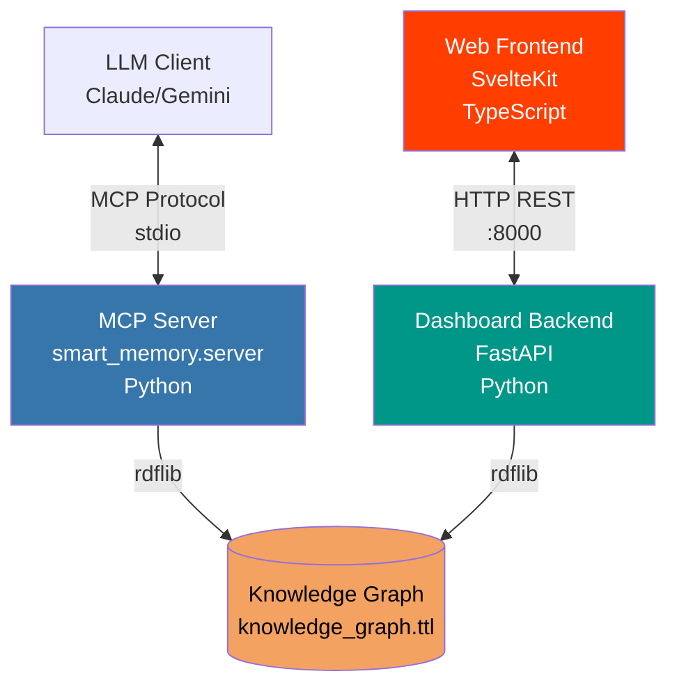
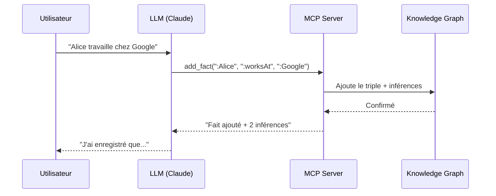
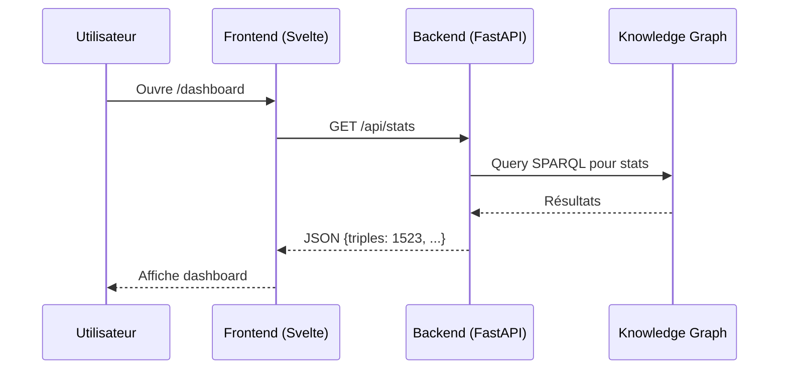

# SmartMemory Architecture

## Overview

SmartMemory consists of **2 main deployment modes** that work complementarily:



---

## 1. MCP Server (Conversational Mode)

**Main file**: `src/smart_memory/server.py`

### Role
- Direct interface between **LLM** (Claude, Gemini, etc.) and the knowledge graph
- Exposes **MCP tools** (13 total) that the LLM can call
- Manages **dual-level inference** (OWL-RL + SPARQL rules)
- Works via the **Model Context Protocol (MCP)**

### Communication
- **Protocol**: MCP via `stdio` (standard input/output)
- **Client**: LLM configured in MCP client settings
- **Transport**: No HTTP, direct communication via pipes/stdin/stdout

### Tools Exposed to LLM
1. `add_memory()` - Add a fact to the graph
2. `query_memory()` - Execute SPARQL queries
3. `search_entity()` - Full-text entity search
4. `verify_inference()` - Confirm/reject inferences
5. `load_custom_rule()` - Load custom inference rule
6. `list_rules()` - List active rules
7. `get_graph_stats()` - Graph statistics
8. `approve_rule()` - Approve pending rule
9. `reject_rule()` - Reject pending rule
10. `get_pending_rules()` - Get rules awaiting approval
11. `get_pending_verifications()` - Get facts awaiting verification
12. `suggest_rule()` - Suggest a new rule
13. `load_document()` - Extract rules from PDF

### Startup
```bash
# Started automatically by MCP client (Claude Desktop, Cline, etc.)
# Or manually for testing:
python -m smart_memory.server
```

> **Note on ontologies**: By default, loading complete ontologies (FOAF, Schema.org) is disabled to optimize startup time. Inference relies primarily on SPARQL rules.

---

## 2. Dashboard Mode (Supervision)

### Rôle
- API REST pour le **dashboard de supervision**
- Permet de visualiser et administrer le système
- Offre une interface **indépendante du LLM**

### Communication
- **Protocole** : HTTP/REST
- **Port** : 8000 (par défaut)
- **Client** : Frontend SvelteKit
- **CORS** : Configuré pour accepter `http://localhost:5173`

### Endpoints API
- `GET /` - Health check
- `GET /health` - Statut détaillé
- `GET /api/stats` - Statistiques du graphe
- `GET /api/facts` - Liste des faits
- `GET /api/rules` - Règles d'inférence
- `GET /api/inference` - Contrôle de l'inférence

### Démarrage
```bash
cd src/supervision_backend
uvicorn main:app --reload --port 8000
```

---

## 3. Web Frontend (Client Web)

**Répertoire** : [`src/supervision_frontend/`](file:///home/momo/Antigravity/SmartMemory/src/supervision_frontend)

### Rôle
- **Interface utilisateur** pour superviser le système
- Dashboard avec visualisations, graphiques, administration
- Permet de contrôler l'inférence sans passer par le LLM

### Communication
- **Protocole** : HTTP (fetch API)
- **Serveur cible** : Backend FastAPI sur `http://localhost:8000`
- **Port de dev** : 5173 (Vite dev server)

### Technologies
- **Framework** : SvelteKit
- **Langage** : TypeScript
- **Build** : Vite
- **UI** : Svelte 5 avec runes

### Démarrage
```bash
cd src/supervision_frontend
npm run dev -- --open
```

---

## Interconnexions

### 1. LLM ↔ MCP Server
```
Claude Desktop Config (JSON)
    ↓
Démarre src/server.py via Python
    ↓
Communication bidirectionnelle via MCP
    - LLM envoie des appels d'outils
    - MCP Server répond avec résultats
```

### 2. Frontend ↔ Backend
```
SvelteKit (5173)
    ↓ HTTP GET/POST
Backend FastAPI (8000)
    ↓ Réponses JSON
SvelteKit affiche les données
```

### 3. Accès au Knowledge Graph

**Les deux serveurs accèdent au même graphe** :
- **MCP Server** : Lecture/écriture via `PersistenceService`
- **HTTP Backend** : Lecture/écriture via les mêmes services

**Fichier partagé** : `knowledge_graph.ttl` (format Turtle RDF)

> ⚠️ **Important** : Pas de synchronisation en temps réel actuellement. Si le MCP Server modifie le graphe, le Backend doit recharger les données.

---

## Flux de données typiques

### Scénario 1 : Ajout d'un fait via LLM


### Scénario 2 : Consultation via Dashboard


---

## Pourquoi cette architecture ?

### Séparation des préoccupations
1. **MCP Server** : Optimisé pour l'interaction LLM
   - Communication synchrone via stdio
   - Outils adaptés au langage naturel
   
2. **HTTP Backend** : Optimisé pour les applications web
   - API REST standard
   - Endpoints structurés
   
3. **Web Frontend** : Interface utilisateur riche
   - Pas besoin d'un LLM pour administrer
   - Visualisations graphiques

### Avantages
- ✅ **Flexibilité** : Utiliser le système via LLM OU via dashboard
- ✅ **Découplage** : Frontend et MCP Server indépendants
- ✅ **Standards** : MCP pour LLM, REST pour web
- ✅ **Scalabilité** : Backend peut être déployé séparément

### Limitations actuelles
- ⚠️ Pas de synchronisation temps réel entre MCP et HTTP
- ⚠️ Deux serveurs à démarrer séparément
- ⚠️ Duplication possible de logique métier

---

## Résumé

| Module | Technologie | Port | Client | Protocole |
|--------|-------------|------|--------|-----------|
| **MCP Server** | Python + FastMCP | stdio | LLM (Claude) | MCP |
| **HTTP Backend** | FastAPI | 8000 | Frontend | REST |
| **Web Frontend** | SvelteKit | 5173 | Navigateur | HTTP |

**Point commun** : Tous accèdent au même `knowledge_graph.ttl` via `rdflib`.


