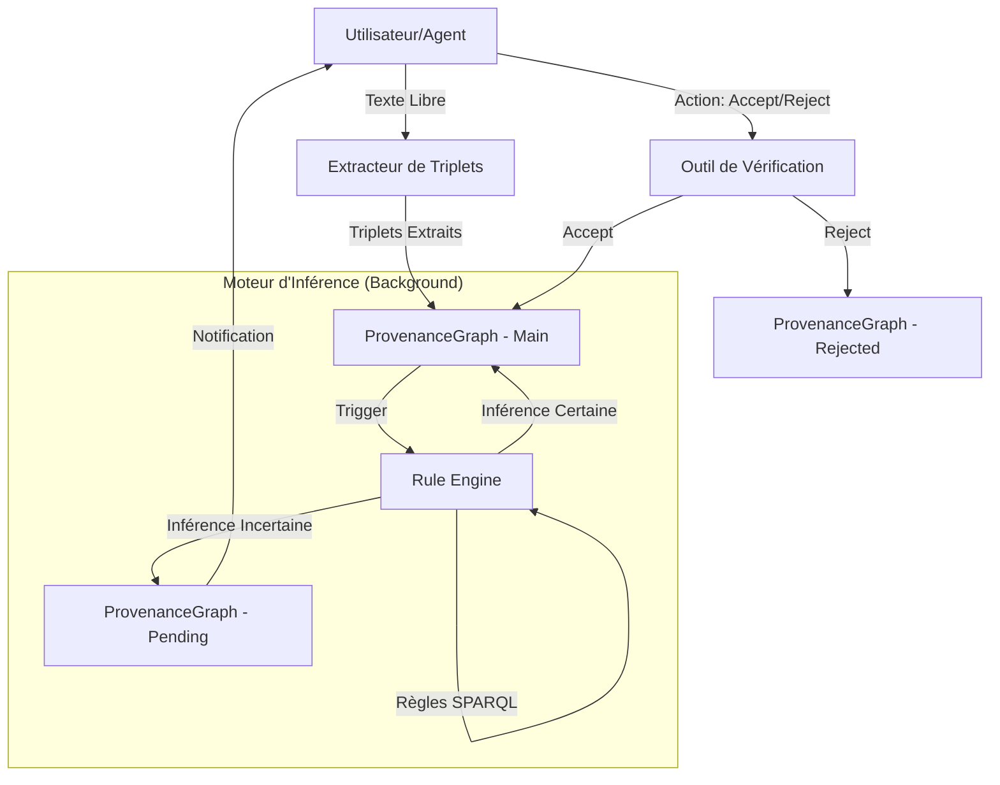
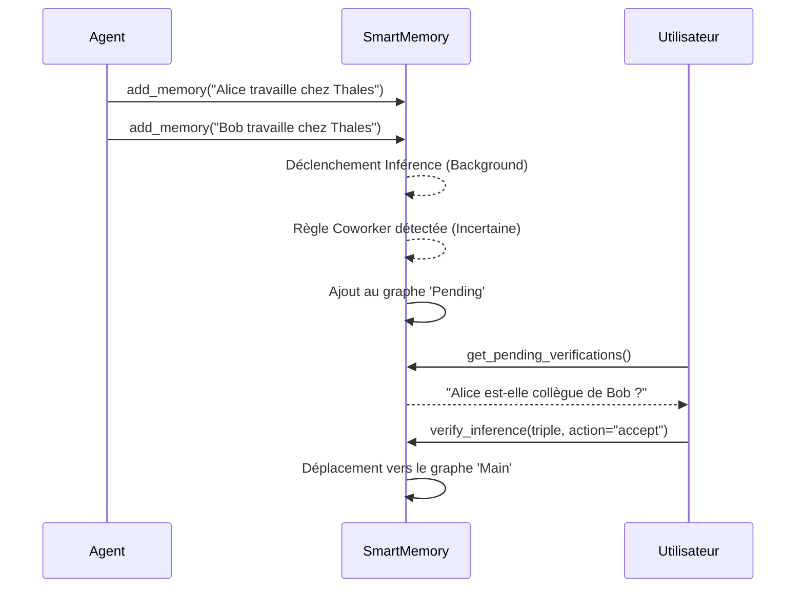

# Architecture de SmartMemory

SmartMemory est un serveur MCP (Model Context Protocol) neuro-symbolique conçu pour doter les agents IA d'une mémoire sémantique persistante et capable de raisonnement.

## Vue d'ensemble du système

Le système repose sur quatre piliers principaux :
1. **Extraction NLP (Neuro)** : Conversion du langage naturel en triplets RDF via des heuristiques et du pattern matching.
2. **Graphe de Connaissances (Symbolique)** : Stockage persistant utilisant RDFLib avec support de la provenance.
3. **Moteur d'Inférence** : Application de règles SPARQL CONSTRUCT pour déduire de nouvelles connaissances.
4. **Gestion de l'Incertitude** : Un workflow de vérification humaine pour les faits déduits avec une confiance modérée.

## Flux de données

## Composants Détaillés

### 1. TripleExtractor (NLP)
Responsable de la transformation du langage naturel en RDF.
- **Segmentation** : Découpage par conjonctions (et, mais, alors) pour gérer les phrases complexes.
- **Heuristiques de Coréférence** : Résolution simple des sujets ("Alice travaille chez Thales et elle connaît Bob").
- **Parsing Turtle** : Support direct de la notation `:S :P :O` pour une précision maximale.

### 2. ProvenanceGraph
Une couche d'abstraction au-dessus de `rdflib` qui gère trois graphes distincts :
- **Main Graph** : Les faits confirmés et immuables.
- **Pending Graph** : Les faits déduits par les règles qui nécessitent une confirmation humaine (marqués par `sem:uncertainPredicate`).
- **Rejected Graph** : Historique des faits explicitement rejetés par l'utilisateur pour éviter qu'ils ne soient ré-inférés.

### 3. RuleEngine & InferenceManager
- **RuleEngine** : Exécute des requêtes SPARQL CONSTRUCT. Il gère les règles par défaut (symétrie, transitivité) et les règles personnalisées chargées dynamiquement.
- **InferenceManager** : Gère l'exécution asynchrone des règles en arrière-plan avec un mécanisme de **debouncing** pour éviter de surcharger le processeur lors d'ajouts massifs.

## Workflow d'Incertitude

Le système utilise une approche de "Human-in-the-loop" pour les déductions sensibles.

## Persistance
Le serveur sauvegarde périodiquement le graphe au format **Turtle (.ttl)**, assurant que la mémoire survit aux redémarrages du serveur. La provenance est conservée via des identifiants uniques (`uuid`) liés à chaque fait.
